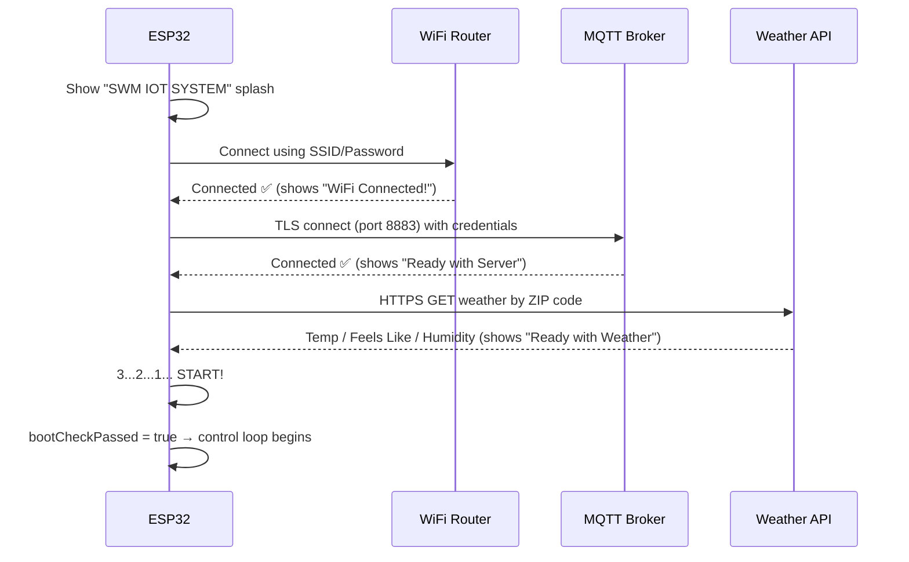
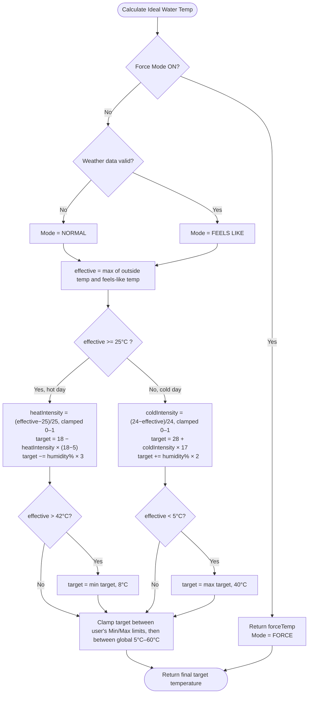
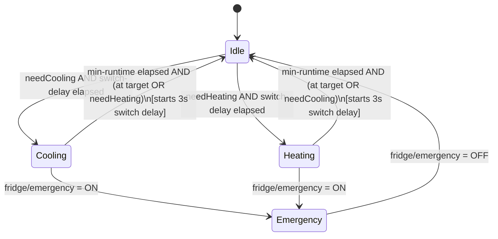

<div align="center">

# 🌊 SWM IoT System — Smart Water Management

### Weather-Aware, Self-Predicting Water Temperature Controller

Built on **ESP32**, controlled over **MQTT (TLS)**, monitored live via a native **Android app**.

[](#)
[-660066?style=for-the-badge&logo=mqtt&logoColor=white)](#)
[](#)
[](#-license)
[](#)
[](#)

`iot` `esp32` `mqtt` `android` `kotlin` `home-automation` `smart-water-system` `weather-api` `embedded-systems` `arduino` `hivemq` `openweathermap`

</div>

---

## 📖 Table of Contents

1. [Overview](#-overview)
2. [Key Features](#-key-features)
3. [How It Works — In Simple Words](#-how-it-works--in-simple-words)
4. [System Architecture](#-system-architecture)
5. [Getting Started — Two Ways to Build This](#-getting-started--two-ways-to-build-this)
6. [Hardware Required (BOM)](#-hardware-required-bom)
7. [Pin Configuration](#-pin-configuration)
8. [Firmware Configuration](#-firmware-configuration)
9. [MQTT Communication Protocol](#-mqtt-communication-protocol)
10. [Boot Handshake Sequence](#-boot-handshake-sequence)
11. [🔬 Deep Dive: The Temperature Prediction Algorithm](#-deep-dive-the-temperature-prediction-algorithm)
12. [🔬 Deep Dive: Relay Safety Engine](#-deep-dive-relay-safety-engine)
13. [Repository Structure](#-repository-structure)
14. [Tech Stack](#-tech-stack)
15. [Disclaimer for Students / Academic Use](#-disclaimer-for-students--academic-use)
16. [License](#-license)
17. [Author](#-author)

---

## 🧾 Overview

**SWM IoT System** (Smart Water Management IoT System) is a self-predicting water temperature controller. Instead of a person manually deciding "मुझे geyser चलाना है या fridge/cooling", the system **reads the live outside weather temperature and humidity of your area** and **automatically calculates the ideal water temperature** it should maintain — then drives a heating relay or a cooling relay to reach that target.

It is a complete end-to-end IoT product with three connected parts:

| Layer | Role |
|---|---|
| 🧠 **ESP32 Firmware** | Reads water temperature, fetches live weather, runs the prediction algorithm, drives relays, shows status on OLED, talks over MQTT |
| ☁️ **MQTT Broker (TLS)** | The secure middleman that carries messages between the ESP32 device and the phone app |
| 📱 **Android App** | Live dashboard to view water temperature, override with "Force Mode", set safety limits, and trigger emergency shutdown |

A **manual "Force Mode"** is also available — if the user wants to override the auto-prediction and lock the water to one fixed temperature, they can do it directly from the app.

---

## ✨ Key Features

- 🌦️ **Weather-based auto prediction** — uses real-time outdoor temperature, "feels like" temperature, and humidity to decide the ideal water temperature.
- 🎯 **Force Mode** — manually pin the target temperature from the app, bypassing weather logic.
- 🔥❄️ **Dual relay control** — one relay for heating (geyser) and one for cooling (compressor), never both together.
- 🛡️ **Hardware-safe switching** — built-in compressor minimum-runtime lock and relay switch-over delay to protect hardware from rapid on/off damage.
- 🚨 **Emergency shutdown** — instantly cuts both relays from the app, with automatic safety delay handling.
- 📟 **Live OLED display** — rotates between water temperature, weather data, and system status pages, with countdown overlays.
- 🟢🔴 **Status LEDs** — dedicated WiFi-status LED (red/green) and MQTT-server-status LED (blink-coded).
- 🔒 **Secure MQTT over TLS** (port 8883) — no data goes over an unencrypted channel.
- 💾 **Persistent settings (NVS)** — hot/cold limits, force mode, and ZIP code survive a power cycle.
- 📱 **Modern Android dashboard** — dark, glass-morphic themed UI (Kotlin, native).
- 🧭 **Strict boot handshake** — device checks WiFi → MQTT → Weather API before entering normal operation, showing each step on the OLED.

---

## 🧩 How It Works — In Simple Words

Think of it like a **thermostat that reads the weather instead of a room sensor**.

```
   ☀️ Hot day outside?  →  System predicts you'll want COLDER water  →  Cooling relay runs
   ❄️ Cold day outside? →  System predicts you'll want HOTTER water  →  Heating relay runs
```

1. ESP32 boots up, connects to WiFi, connects to the MQTT broker, and fetches the current weather for a configured ZIP code from a weather API.
2. Based on outside temperature + "feels like" + humidity, it **calculates an ideal water target temperature**.
3. It compares this target to the actual water temperature (read from a DS18B20 sensor).
4. If water is too warm → it turns ON the **cooling relay**. If too cold → it turns ON the **heating relay**. Both relays are never active together.
5. All of this is pushed live to the Android app over MQTT, so the user can see it in real time and override it whenever they want.

A more technical breakdown of the prediction formula and the relay safety logic is provided further down in the [Deep Dive](#-deep-dive-the-temperature-prediction-algorithm) sections — this part is intentionally kept simple for a quick understanding.

---

## 🏗️ System Architecture

```mermaid
flowchart LR
    subgraph Device["🔌 ESP32 Node"]
        DS[DS18B20\nWater Temp Sensor]
        OLED[0.96" OLED\nSSD1306]
        LED1[WiFi Status LED]
        LED2[Server Status LED]
        RELAY1[Heating Relay\nGeyser]
        RELAY2[Cooling Relay\nCompressor]
        FW[ESP32 Firmware\nPrediction + Control Engine]
    end

    subgraph Cloud["☁️ Cloud Services"]
        MQTT[(MQTT Broker\nTLS · Port 8883)]
        WEATHER[(Weather API\nOpenWeatherMap)]
    end

    subgraph Phone["📱 Android App"]
        UI[Live Dashboard]
        CFG[Broker Config Screen]
    end

    DS --> FW
    FW --> OLED
    FW --> LED1
    FW --> LED2
    FW --> RELAY1
    FW --> RELAY2
    FW <-->|Publish / Subscribe| MQTT
    FW -->|HTTPS GET| WEATHER
    MQTT <-->|Publish / Subscribe| UI
    CFG -.saves broker creds.-> UI
```

**Data direction summary:**

- ESP32 → App: live water temp, target temp, mode, relay status, signal strength, uptime, weather data.
- App → ESP32: ZIP code, hot/cold limits, force mode + force temperature, emergency stop.

---

## 🚀 Getting Started — Two Ways to Build This

If you are a student replicating this project for a semester submission, you have **two options**. Pick whichever suits your timeline.

### 🅰️ Option A — Fast Track (Recommended for most students)

Use the **already-built Android APK** provided in this repository and only work on the ESP32 hardware + firmware.

1. Download `SWM IOT SYSTEM.apk` from this repository and install it on an Android phone (enable "Install from unknown sources" for your file manager/browser).
2. Flash the firmware (`SWM CODE.ino`) onto your ESP32 using Arduino IDE, after filling in your own credentials (see [Firmware Configuration](#-firmware-configuration)).
3. Wire up the hardware as per the [Pin Configuration](#-pin-configuration) table.
4. Open the app → enter the same MQTT broker host, username, and password that you used in the firmware → tap **Connect & Save**.
5. Done — the dashboard will start showing live data.

> ✅ This path needs **zero Android development knowledge**. You only need to work with the ESP32 firmware.

### 🅱️ Option B — Build Your Own App from Source

The full Android app source code (`SWM APK CODE/`) is included in this repository — written in **Kotlin**, using **Android Studio**. If your evaluation requires you to demonstrate that you built the companion app yourself (not just the firmware), open this folder as an Android Studio project, review/modify it, and build your own APK from it.

- Project language: **Kotlin**
- Build tool: **Gradle** (wrapper included)
- Min SDK: 24 · Target/Compile SDK: 34
- MQTT client library: **HiveMQ MQTT Client** (Android)

> ⚠️ Per the request of the project author, this README explains **what the app needs and where to obtain each requirement** — not a line-by-line tutorial on rebuilding the app UI/logic. The full source is already provided in the repo for you to study directly.

---

## 🔩 Hardware Required (BOM)

| # | Component | Purpose |
|---|---|---|
| 1 | ESP32 DevKit V1 | Main controller (WiFi + dual-core MCU) |
| 2 | DS18B20 (waterproof probe) | Measures actual water temperature |
| 3 | 4.7kΩ resistor | Pull-up resistor for the DS18B20 OneWire data line |
| 4 | 0.96" OLED Display (SSD1306, I2C, 128×64) | Local status display |
| 5 | 2-Channel Relay Module (5V) | Switches the heating and cooling loads |
| 6 | 2x LEDs (any color pair, e.g. Red/Green) | WiFi connection status indicator |
| 7 | 1x LED (Green) | MQTT/server connection status indicator |
| 8 | Heating element / Geyser rod (load side) | Heats the water — driven via relay |
| 9 | Cooling unit / Compressor (load side) | Cools the water — driven via relay |
| 10 | 5V/3.3V regulated power supply | Powers ESP32 + peripherals |
| 11 | Jumper wires, breadboard/PCB, enclosure | Assembly |

> ⚠️ **Safety note:** the relay outputs in this project are meant to switch mains-connected heating/cooling appliances. Any wiring that touches AC mains must be done with proper insulation, fusing, and — ideally — supervision from someone experienced with mains electrical work. This is standard safety practice for any relay-based home automation project, student or professional.

---

## 📌 Pin Configuration

| ESP32 GPIO | Connected To | Function |
|---|---|---|
| GPIO 4 | DS18B20 (Data) | OneWire water temperature sensor |
| GPIO 5 | Relay Channel 1 | Cooling load (compressor) |
| GPIO 18 | Relay Channel 2 | Heating load (geyser) |
| GPIO 21 (SDA) / GPIO 22 (SCL) | OLED Display | I2C bus (default ESP32 pins), address `0x3C` |
| GPIO 2 | Green LED | MQTT/server status indicator |
| GPIO 19 | Red LED | WiFi status (disconnected) |
| GPIO 15 | Green LED | WiFi status (connected) |

All pin numbers are defined as constants at the top of `SWM CODE.ino`, so they can be changed easily if your board layout differs.

---

## ⚙️ Firmware Configuration

Open `ESP32 SWM/ESP32 CODE/SWM CODE.ino` in Arduino IDE. Near the top of the file is a clearly marked configuration block:

```cpp
#define WIFI_SSID       "ENTER YOUR WI-FI SSID"
#define WIFI_PASSWORD   "ENTER YOUR WI-FI PASSWORD"

#define MQTT_SERVER     "ENTER YOUR MQQT SERVER ADDRESS"
#define MQTT_PORT       8883
#define MQTT_USER       "ENTER YOUR MQQT USERNAME"
#define MQTT_PASS       "ENTER YOUR MQQT PASSPORT"
#define MQTT_CLIENT_ID  "ESP32_SmartFridge"
#define MQTT_USE_SSL    true

#define WEATHER_API_KEY "ENTER YOUR WEATHER API"
```

Every value here **must be filled in by you** before uploading. Here is what each one is, and **where you can obtain it** (this README only tells you *where to get it* — not a step-by-step signup tutorial):

| Field | What it is | Where to get it |
|---|---|---|
| `WIFI_SSID` / `WIFI_PASSWORD` | Your local WiFi network credentials | Your own router/hotspot settings |
| `MQTT_SERVER` | Hostname of a TLS-enabled MQTT broker | A managed MQTT broker service such as **HiveMQ Cloud** (has a free tier with TLS on port 8883) or any other MQTT-as-a-service provider of your choice |
| `MQTT_USER` / `MQTT_PASS` | Login credentials for that broker | Created inside your MQTT broker's dashboard, after you sign up |
| `MQTT_PORT` | Secure MQTT port | Default `8883` (TLS) — matches what most managed brokers use |
| `WEATHER_API_KEY` | API key to fetch live weather data | **OpenWeatherMap** (the firmware calls `api.openweathermap.org` directly) — free-tier API keys are available from their developer portal |

> The **same MQTT host, username, and password** you put here must also be entered on the Android app's **Config screen** — both sides need to speak to the *same* broker for the system to work.

### Required Arduino Libraries

Install these via Arduino IDE → *Library Manager* (or manually) before compiling:

| Library | Used For |
|---|---|
| `PubSubClient` | MQTT client |
| `OneWire` | Communication protocol for the DS18B20 |
| `DallasTemperature` | Reading DS18B20 temperature values |
| `Adafruit_GFX` | Graphics primitives for the OLED |
| `Adafruit_SSD1306` | OLED display driver |
| `ArduinoJson` | Parsing the weather API's JSON response |
| `WiFi`, `WiFiClientSecure`, `HTTPClient`, `Preferences`, `Wire`, `time.h` | Built into the ESP32 board package — no separate install needed |

You'll also need the **ESP32 board package** added to Arduino IDE via the Boards Manager before you can select "ESP32 Dev Module" as your target board.

---

## 📡 MQTT Communication Protocol

The ESP32 and the Android app talk exclusively through topics under the `fridge/` namespace (kept from the original prototype naming — the system controls **water temperature**, not literally a fridge).

### 🔽 Topics the ESP32 SUBSCRIBES to (App → Device commands)

| Topic | Payload | Effect |
|---|---|---|
| `fridge/setZip` | 6-digit ZIP code | Updates the weather lookup location |
| `fridge/setHotLimit` | Integer °C | Sets the maximum allowed target temperature |
| `fridge/setColdLimit` | Integer °C | Sets the minimum allowed target temperature |
| `fridge/forceMode` | `"ON"` / `"OFF"` | Enables/disables manual override mode |
| `fridge/forceTemp` | Integer °C | Fixed target used while Force Mode is ON |
| `fridge/requestSync` | any | Asks the device to re-publish all current settings |
| `fridge/emergency` | `"ON"` / `"OFF"` | Immediately cuts both relays / restores normal operation |

### 🔼 Topics the ESP32 PUBLISHES (Device → App live data)

| Topic | Payload | Meaning |
|---|---|---|
| `fridge/waterTemp` | Float | Live water temperature |
| `fridge/targetTemp` | Float | Currently calculated ideal target |
| `fridge/opMode` | `NORMAL` / `FEELS LIKE` / `FORCE` | Which prediction mode is active |
| `fridge/relayStatus` | `IDLE (OFF)` / `COMPRESSOR ON` / `GEYSER ON` | Live relay state |
| `fridge/countdown` | `RUN:<sec>` / `SWITCH:<sec>` / `0` | Safety-timer countdown |
| `fridge/signal` | 0–100 | WiFi signal strength percentage |
| `fridge/ping` | ms (simulated) | Latency indicator shown in-app |
| `fridge/uptime` | `"Hh Mm"` | Device uptime since boot |
| `fridge/weatherData` | Float | Outdoor "feels like" temperature |
| `fridge/feedback/hotLimit` | Integer | Confirms current max limit setting |
| `fridge/feedback/coldLimit` | Integer | Confirms current min limit setting |
| `fridge/feedback/forceMode` | `ON`/`OFF` | Confirms Force Mode state |
| `fridge/feedback/forceTemp` | Integer | Confirms force target |
| `fridge/feedback/emergency` | `ON`/`OFF` | Confirms emergency shutdown state |
| `fridge/feedback/zipStatus` | `SUCCESS`/`ERROR` | Confirms whether the new ZIP code was valid |

This publish/subscribe map is the entire "API" of the system — anyone building their own app (Option B above) needs to implement a client that speaks exactly these topics.

---

## 🔄 Boot Handshake Sequence

On every power-up, the ESP32 runs a **strict, visual boot sequence** on the OLED before entering normal operation — useful both functionally and for demoing the project to evaluators.



If WiFi fails, the device waits and retries indefinitely (shows "Please Connect WiFi..."). If the MQTT broker or the weather API fails, the device shows an error on-screen but **still continues to boot** — falling back to a safe default weather value so the system remains usable offline.

---

## 🔬 Deep Dive: The Temperature Prediction Algorithm

This is the core "smart" part of the project — the function `calculateIdealWaterTemp()`.

### Step-by-step logic



### Explained in plain language

- **If it's hot outside** (25°C or above), the system assumes people want **colder water**, so it aims low — anywhere between 5°C and 18°C depending on exactly how hot it is. The hotter it gets, the closer to 5°C the target goes. Higher humidity pushes the target even a bit lower (humid heat feels worse, so slightly colder water compensates).
- **If it's cold outside** (below 25°C), the system assumes people want **warmer water**, so it aims high — anywhere between 28°C and 45°C depending on exactly how cold it is. The colder it gets, the closer to 45°C the target goes. Higher humidity nudges the target slightly higher too.
- **Extreme weather safety clamps:** if it's scorching hot (>42°C outside) the target is forced down close to the coldest allowed value; if it's freezing (<5°C outside) the target is forced up to at least 40°C.
- **User limits always win last:** whatever the formula calculates, it is always squeezed back inside the user-configured Min/Max range (`fridge/setColdLimit` / `fridge/setHotLimit`), and then inside the hard global safety range (5°C–60°C), so the algorithm can never push the system outside safe bounds.
- **Force Mode bypasses all of this** — the target simply becomes whatever fixed number the user set in the app.

This runs continuously (every `CONTROL_INTERVAL` = 500ms) once the weather has been refreshed (every `WEATHER_FETCH_INTERVAL` = 10 minutes), so the target temperature quietly adapts through the day as the weather changes.

---

## 🔬 Deep Dive: Relay Safety Engine

Rapidly flipping a compressor or heating element on/off can damage the hardware. So `controlTemperature()` enforces three protection rules before actuating anything:

| Rule | Value | Purpose |
|---|---|---|
| **Hysteresis band** | ±2.0°C around target | Prevents the relay from chattering on/off right at the target temperature |
| **Minimum runtime lock** | 60 seconds | Once a relay turns ON, it is guaranteed to stay ON for at least 60s before it's allowed to turn OFF |
| **Switch-over delay** | 3 seconds | After any relay turns OFF, the system waits 3s of "cool-down" before allowing the *other* relay to turn ON |
| **Mutual exclusion** | — | Heating and cooling relays are **never** active at the same time |
| **Emergency override** | Instant | The `fridge/emergency` topic can force both relays OFF immediately, ignoring all above timers on the way down |



This state machine — combined with the live countdown shown both on the OLED (`Min Run: Xs` / `Wait: Xs`) and published over MQTT (`fridge/countdown`) — is what makes the system safe to leave running unattended.

---

## 📂 Repository Structure

```
SWM-IOT-SYSTEM/
│
├── ESP32 SWM/
│   └── ESP32 CODE/
│       └── SWM CODE.ino          → Full ESP32 firmware (single-file, register/driver level)
│
├── SWM APK CODE/                 → Full Android Studio project (Kotlin)
│   └── app/src/main/java/com/swm/iotsystem/
│       ├── SplashActivity.kt     → App launch/splash screen
│       ├── ConfigActivity.kt     → MQTT broker configuration screen
│       └── DashboardActivity.kt  → Live dashboard, controls, MQTT pub/sub logic
│
├── SWM IOT SYSTEM.apk            → Ready-to-install Android app (Option A path)
├── swm_iot_system.png            → Project artwork
└── LICENSE                       → MIT License
```

---

## 🧰 Tech Stack

| Layer | Technology |
|---|---|
| Microcontroller | ESP32 DevKit V1 |
| Firmware Language | C++ (Arduino framework) |
| Messaging Protocol | MQTT v3, secured with TLS (port 8883) |
| Mobile App | Kotlin, native Android (View Binding) |
| MQTT Client (App) | HiveMQ MQTT Client for Android |
| Weather Data | OpenWeatherMap REST API |
| Local Storage | ESP32 NVS (`Preferences`) on-device, `SharedPreferences` on Android |
| Display | SSD1306 OLED via I2C (Adafruit GFX/SSD1306) |
| Sensor | DS18B20 (OneWire digital temperature probe) |

---

## 🎓 Disclaimer for Students / Academic Use

This project is shared for educational and personal-project purposes. If you're using it for a semester/college submission:

- Understand the logic (especially the [prediction algorithm](#-deep-dive-the-temperature-prediction-algorithm) and [safety engine](#-deep-dive-relay-safety-engine)) well enough to explain it in your own words during evaluation.
- All credentials (`WIFI_SSID`, `MQTT_SERVER`, API keys, etc.) are placeholders — you must obtain and fill in your own; none are bundled with this repository.
- Mains-voltage relay wiring (heater/compressor loads) should be done carefully and safely — take guidance from someone experienced if you're not confident with AC wiring.
- Feel free to build on top of this project (Option B) and extend it — it's released under the MIT License specifically to allow that.

---

## 📜 License

This project is licensed under the **MIT License** — see the [`LICENSE`](./LICENSE) file for details. You are free to use, modify, and distribute this project, including for academic submissions, with attribution.

```
MIT License
Copyright (c) 2026 SHRIDEV
```

---

## 👤 Author

**SHRIDEV**
Electronics Engineering — IoT & Embedded Systems

If this project helped you, consider ⭐ starring the repository.
